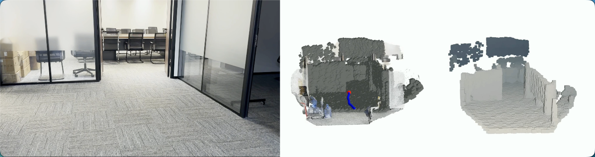

<h1 align="center">🌌 L3ROcc: Local 3D Reconstruction with Occupancy</h1>

<p align="center">
    <a href="https://arxiv.org/abs/2507.13347" target="_blank">
    
    </a>
    <a href="#" target="_blank">
    
    </a>
    <a href="#" target="_blank">
    
    </a>
</p>

<div align="center">
  <a href="https://youtu.be/oqntFdGxhwg" target="_blank">
    
  </a>
  
  <p><i>Left: RGB Input | Middle: 3D Point Cloud Fusion | Right: 4D Occupancy Grid</i></p>
  <p>
    <b>🎥 <a href="https://youtu.be/oqntFdGxhwg">Watch Full Demo on YouTube</a></b> | 
  </p>
</div>

`L3ROcc` is a high-performance visual geometry framework designed to transform standard RGB video sequences into high-precision **3D Point Clouds**, **3D Occupancy Grids**, and **4D Temporal Observation Data**.
The project utilizes **$\pi^3$ (Permutation-Equivariant Visual Geometry Learning)** as its underlying reconstruction engine and provides a fully automated data labeling and alignment pipeline tailored for navigation learning. The processed data is formatted according to the **LeRobotDataset v2.1** specification.

## ✨ Key Features
* **End-to-End Reconstruction**: Directly predicts affine-invariant camera poses and scale-invariant globally point clouds from RGB video streams.
* **Automated Voxelization**: Converts unstructured point clouds into structured Occupancy Grids.
* **Visibility Analysis**: Performs real-time ray casting based on intrinsic and extrinsic parameters of camera to compute visible regions (Visible Masks) and occlusion relationships.
* **4D Data Serialization**:
    * **Sparse OCC**: Utilizes Sparse CSR matrices to store temporal occupancy, significantly reducing disk usage.
    * **Packed Mask**: Implements bit-packing (via `np.packbits`) for visibility masks to optimize storage efficiency.
* **Multi-Dataset Adaptation**: Built-in generators for both `SimpleVideo` (single video) and `InternNav` (large-scale datasets).
* **Professional Visualization**: Mayavi-based 3D rendering tools for generating side-by-side comparison videos of point clouds, trajectories, and occupancy.

## 💡 Future Work 
- [ ] **Semantic Point Cloud**: Integrate semantic segmentation, and instance segmentation to enhance reconstruction quality.
- [ ] **Multi-modal Fusion**: Integrate depth maps to enhance reconstruction quality.


## 🚀 Quick Start

### 1. Clone & Install Dependencies
#### (1). Clone the Repository
```bash
git clone --recursive ssh://git@10.9.46.21:9022/ch_robot/alg_group/vln/occgen.git
cd occgen
```
#### (2). Install Python Dependencies
##### i. For Production (Generating OCC data for InternNav/LeRobot):
Python 3.10+ is recommended. Install the following dependencies:
```bash
conda create -n <env> python=3.10 -y
conda activate <env>
pip install -e .
pip install -e third_party/pi3
```
##### ii. For Visualization (Rendering dynamic videos & 3D inspection):
3D rendering requires a GUI environment. Please set up this environment on your local computer (Windows/macOS/Linux), not on the remote server：
```bash
# Run on your local machine
conda create -n <env> python=3.8 -y
conda activate <env>
pip install -r requirements_visual.txt
conda install -c conda-forge mayavi
```
(Note: Ensure you have a working OpenGL environment for Mayavi rendering.)

### 2.Model Checkpoints
Place the $\pi^3$ model weights (model.safetensors) and configuration files in the ckpt/ directory at the project root. If the automatic download from Hugging Face is slow, you can download the model checkpoint manually from [here](https://huggingface.co/yyfz233/Pi3/resolve/main/model.safetensors).

### 3. Run Example （The pipeline supports three primary modes）:
#### Mode A: Generate Visualized Dynamic Video Use this to create side-by-side comparison videos from your own footage with history frames.
```bash
python tools/run_normal_data_occ.py --video_path data/examples/office.mp4 --save_dir data/examples/outputs/ --mode visual
```
#### Mode B: Generate LeRobot-compatible Data Use this to generate the standard dataset structure for model training.
```bash
python tools/run_normal_data_occ.py --video_path data/examples/office.mp4 --save_dir data/examples/outputs/ --mode run
```
#### Mode C: Batch Process InternNav Dataset To process the full InternNav directory with scale alignment enabled.
```bash
python tools/run_intern_nav_occ.py 
```

## 🛠️ Pipeline Details

### 1. Data Generators

Located in `L3ROcc/generater/`, the project includes two core generators:

* **SimpleVideoDataGenerator**: Best for individual videos; automatically builds standard directory structures including `meta/`, `videos/`, and `data/`.
* **InternNavDataGenerator**: Designed for large-scale InternNav data enhancement; supports **Scale Alignment** using Sim3 to ensure reconstruction coordinates match ground truth.

### 2. Core Configuration

Parameters can be tuned in `L3ROcc/configs/config.yaml`:

* **`pc_range`**: Spatial clipping and perception range `[x_min, y_min, z_min, x_max, y_max, z_max]`, which defines the effective field of view.
* **`voxel_size`**: Base size for occupancy voxels (e.g., 0.02m), which is directly related to the sparsity of the occupancy voxel map.
* **`occ_size`**: Number of voxel grids in each spatial dimension, derived from `(pc_range_max - pc_range_min) / voxel_size` with no independent configuration.
* **`interval`**: Frame sampling interval for video processing.
* **`history_len`**: Number of past frames to include in history (default: 10).
* **`history_step`**: Step size for history frame sampling (default: 2).


### 3.Dataset Structure & Contents 

#### (1). InternNav Format
The following structure is generated under each trajectory directory (e.g., trajectory_1) to ensure compatibility with robotics learning frameworks:

```
trajectory_1/
├── data/
│   └── chunk-000/                 # Core Geometric Assets
│       ├── all_occ.npz            # Global scene occupancy grid
│       ├── origin_pcd.ply         # Downsampled global point cloud
│       └── episode_000000.parquet # Per-frame poses and intrinsics
├── meta/                          # Metadata & Statistics
│   ├── info.json                  # Dataset schema and feature definitions
│   ├── episodes.jsonl             # Episode metadata and Sim3 scale factors
│   ├── episodes_stats.jsonl       # Feature statistics (min/max/mean/std)
│   └── tasks.jsonl                # Task descriptions
└── videos/
    └── chunk-000/                 # Temporal Sequences
        ├── observation.occ.mask/
        │   └── mask_sequence.npz  # Temporal visibility bitmask
        ├── observation.occ.view/
        │   └── occ_sequence.npz   # Temporal egocentric occupancy
        └── observation.video.trajectory/
            └── reference.mp4      # Original RGB source video
```

##### i. data/chunk-000/ (Core Geometric Assets)
- **all_occ.npz**: Stores the global occupancy grid of the entire scene in world coordinates.
- **origin_pcd.ply**: The initial global point cloud reconstructed from the video, optimized via voxel downsampling for efficient processing.
- **episode_000000.parquet**: A structured data table containing per-frame high-level features:
  - **Camera Intrinsics_occ**: 3x3 matrices re-estimated via Least Squares/DLT based on local geometry.
  - **Camera Extrinsics_occ**: 4x4 extrinsic matrices predicted by the π³ model and aligned to world coordinates.

##### ii. meta/ (Metadata & Statistics)
- **info.json**: Defines the dataset schema, including the data types and shapes for observation.camera_extrinsic_occ and observation.camera_intrinsic_occ.
- **episodes.jsonl**: Contains episode-level constants, most notably the Sim3 Scale Factor used to align the model's relative units to real-world metric scales.
- **episodes_stats.jsonl**: Automatically calculates the statistical distribution (min, max, mean, std) for all observation vectors.
- **tasks.jsonl**: Provides task descriptions and objectives for the dataset.

##### iii. videos/chunk-000/ (Temporal Sequences)
- **observation.occ.mask/mask_sequence.npz**: A time-series of visibility masks. It uses an optimized Bit-packing format to store which voxels are currently visible within the camera's frustum.
- **observation.occ.view/occ_sequence.npz**: A time-series of egocentric occupancy data. Each frame represents the occupied voxels in the current camera coordinate system, stored as a Sparse CSR Matrix to minimize storage overhead.
- **observation.video.trajectory/reference.mp4**: The original RGB video sequence used as input for reconstruction.

#### (2). Visual Format

Outputs generated by the `visual_pipeline` are tailored for rendering and manual inspection:

| Directory/File | Description |
|---------------|-------------|
| `merge_npy_sequence_cam.npy` | Files per frame in Camera Coordinates, merging initial PCD and visible OCC. |
| `merge_npy_sequence_world.npy` | Files per frame in World Coordinates, used for rendering dynamic fused videos. |
| `merge_ply_sequence_cam.ply` | Files per frame in Camera Coordinates for 3D inspection (e.g., MeshLab). |
| `merge_ply_sequence_world.ply` | Files per frame in World Coordinates for 3D inspection. |
| `occ_only_cam_npy.npy` | Files per frame containing only visible OCC in Camera Coordinates for rendering. |
| `occ_only_cam_ply.ply` | Files per frame containing only visible OCC for 3D inspection. |

## 📺 Visualization & Toolbox

A variety of scripts are provided in `tools/visual/` for visualization and analysis:

| Script | Description |
|--------|-------------|
| `visual_simple_frame_npy.py` | Interactive single-frame debugger. Loads individual voxel .npy files, supports interactive view rotation in Mayavi, and prints real-time camera pose parameters (Position/Focal/ViewUp) to determine the optimal fixed view for video rendering. |
| `visual_simple_frame_npz.py` | Fast sparse matrix viewer. Directly reads compressed .npz  or .npy files to quickly verify the integrity of generated occupancy data without decompressing the entire sequence. |
| `npy_to_world_video.py` | God's eye (World-View) fusion rendering. Generates third-person global reconstruction videos containing three key elements: true-color background point clouds, global camera trajectories , and accumulated occupancy grids . |
| `npy_to_occ_video.py` | Egocentric (First-Person) stylized rendering. Generates first-person videos with only local occupancy, using Morandi color palette for depth-gradient shading to showcase pure spatial geometric structures. |
| `video_composer_to_3.py` | 3-Panel panoramic composer. Horizontally stitches three video streams to generate the final demo video, typically including: original RGB input video, world-view fusion video, and local occupancy video. |

## 🙏 Acknowledgements

This project is built upon the following excellent works:

  * [π³](https://github.com/yyfz/Pi3)
  * [Occ3D](https://arxiv.org/pdf/2304.14365)
  * [SurroundOcc](https://github.com/weiyithu/SurroundOcc)
  * [InternData-N1](https://huggingface.co/datasets/InternRobotics/InternData-N1)

## 🐼 Core Contributors

**Nianjin Ye**<sup>1*</sup>([GitHub](https://github.com/CallMeFrozenBanana)), **Binling Huang**<sup>12*</sup>([GitHub](https://github.com/hbl-0624)), **Hao Xu**<sup>3</sup>([GitHub](https://hxwork.github.io/))

<sup>1</sup>Sichuan Embodied Intelligence Robot Training Base     <sup>2</sup>UESTC     <sup>3</sup>CUHK     <sup>*</sup> (Equal Contribution)

## 📜 Citation

If you find our work useful, please consider citing:

```bibtex
@misc{wang2025pi3,
      title={$\pi^3$: Scalable Permutation-Equivariant Visual Geometry Learning}, 
      author={Yifan Wang and Jianjun Zhou and Haoyi Zhu and Wenzheng Chang and Yang Zhou and Zizun Li and Junyi Chen and Jiangmiao Pang and Chunhua Shen and Tong He},
      year={2025},
      eprint={2507.13347},
      archivePrefix={arXiv},
      primaryClass={cs.CV},
      url={https://arxiv.org/abs/2507.13347}, 
}
```


## 📄 License
For academic use, this project is licensed under the MIT License. See the [LICENSE](./LICENSE) file for details. For commercial use, please contact the authors.